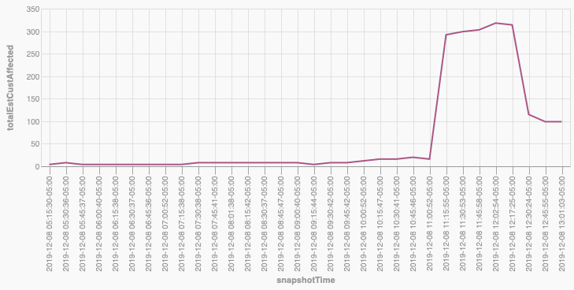

When the power is out, it makes peoples' lives very hard. Things like cooking, bathing, and staying warm become difficult, if not impossible. Because of the importance of electricity in our everyday lives, we have regulators like the [Kentucky Public Service Commission](https://psc.ky.gov/Home/Utilities) to oversee utilities in Kentucky.

But what if consumers or advocates want to dig deeper into power outages to look for trends or better understand why power outages are occurring? How can they get historical data about outages? Until now, there hasn't been a way.
<!--more-->

### LG&E and KU Energy Outage Data

Today, we are announcing the availability of a dataset of LG&E and KU Energy outages. The dataset starts on December 7, 2019 and will have new outages added to it as they occur. Our hope is that this dataset will become more and more useful as it grows.

The data comes from the [LG&E/KU outage map](https://stormcenter.lge-ku.com/default.html). Each outage is catalogued and stored for future analysis.

Every 6 hours, we publish the data to an online database that anyone can access at [http://poweroutages.codeforkentuckiana.org/outages](http://poweroutages.codeforkentuckiana.org/outages).

This online database is powered by a tool called [Datasette](https://github.com/simonw/datasette) that allows for exploration of the data. The data can be viewed and explored by clicking through the website or by using the SQL query language. We know that there is still a level of technical knowlege required to work with the data. It's our hope that others will take the data, perform analysis on it, and share their findings.

One such example is the San Francisco Chronicle's project that used historiacl PG&E data build an [app comparing wind speed and power outages](https://projects.sfchronicle.com/2019/wind-outage-map/).

Please reach out if you have ideas about how to use the data and need any help.

#### Understading the database

We are following the same format Simon Willison used for his [PG&E outage tracking project](https://simonwillison.net/2019/Oct/10/pge-outages/). He has a great explanation for how the database works (adapted for LG&E/KU):

> The three key tables to understand are `outages`, `snapshots` and `outage_snapshots`.
>
> LG&E/KU assigns an outage ID to every outage. I store these in the [outages table](http://poweroutages.codeforkentuckiana.org/outages/outages).
>
> Every 15 minutes I grab a snapshot of storm map, which reports every single outage that is currently ongoing. I store a record of when I grabbed that snapshot in the [snapshots table](http://poweroutages.codeforkentuckiana.org/outages/snapshots).
>
> The most interesting table is `outage_snapshots`. Every time I see an outage on the storm map, I record a new copy of its data as an `outage_snapshot` row. This allows me to reconstruct the full history of any outage, in 15 minute increments.
>
> Here are [all of the outages](http://poweroutages.codeforkentuckiana.org/outages/outage_snapshots?snapshot=68) that were represented in [snapshot 68](http://poweroutages.codeforkentuckiana.org/outages/snapshots/68)—captured at 12:17pm Eastern Time on December 8, 2019.
>
> I can run `select sum(estCustAffected) from outage_snapshots where snapshot = 68` ([try it here](http://poweroutages.codeforkentuckiana.org/outages?sql=select+sum%28estCustAffected%29+from+outage_snapshots+where+snapshot+%3D+%3Aid&id=68)) to count up the total LG&E/KU estimate of the number of affected customers (314 at this time).

#### Visualizing data

It is possible to visualize outage data using a couple of [Datasette plugins](https://datasette.readthedocs.io/en/stable/plugins.html) that we have installed.

Each table has tools to build charts and maps. For example:

<a href="http://poweroutages.codeforkentuckiana.org/outages?sql=select+snapshots.id%2C+title+as+snapshotTime%2C+hash%2C+sum%28outage_snapshots.estCustAffected%29+as+totalEstCustAffected%0D%0Afrom+snapshots+join+outage_snapshots+on+snapshots.id+%3D+outage_snapshots.snapshot%0D%0Awhere+snapshots.id+%3E%3D+40+and+snapshots.id+%3C%3D+71%0D%0Agroup+by+snapshots.id+order+by+snapshots.id+desc+limit+150#g.mark=line&g.x_column=snapshotTime&g.x_type=ordinal&g.y_column=totalEstCustAffected&g.y_type=quantitative"></a>
Here is a <a href="http://poweroutages.codeforkentuckiana.org/outages?sql=select+snapshots.id%2C+title+as+snapshotTime%2C+hash%2C+sum%28outage_snapshots.estCustAffected%29+as+totalEstCustAffected%0D%0Afrom+snapshots+join+outage_snapshots+on+snapshots.id+%3D+outage_snapshots.snapshot%0D%0Awhere+snapshots.id+%3E%3D+40+and+snapshots.id+%3C%3D+71%0D%0Agroup+by+snapshots.id+order+by+snapshots.id+desc+limit+150#g.mark=line&g.x_column=snapshotTime&g.x_type=ordinal&g.y_column=totalEstCustAffected&g.y_type=quantitative">chart of the number of affected customers over time.</a>

<a href="http://poweroutages.codeforkentuckiana.org/outages?sql=select+snapshots.id%2C+title+as+snapshotTime%2C+hash%2C+sum%28outage_snapshots.estCustAffected%29+as+totalEstCustAffected%0D%0Afrom+snapshots+join+outage_snapshots+on+snapshots.id+%3D+outage_snapshots.snapshot%0D%0Awhere+snapshots.id+%3E%3D+40+and+snapshots.id+%3C%3D+71%0D%0Agroup+by+snapshots.id+order+by+snapshots.id+desc+limit+150#g.mark=line&g.x_column=snapshotTime&g.x_type=ordinal&g.y_column=totalEstCustAffected&g.y_type=quantitative"></a>
Here is a <a href="http://poweroutages.codeforkentuckiana.org/outages?sql=select+snapshots.id%2C+title+as+snapshotTime%2C+hash%2C+sum%28outage_snapshots.estCustAffected%29+as+totalEstCustAffected%0D%0Afrom+snapshots+join+outage_snapshots+on+snapshots.id+%3D+outage_snapshots.snapshot%0D%0Awhere+snapshots.id+%3E%3D+40+and+snapshots.id+%3C%3D+71%0D%0Agroup+by+snapshots.id+order+by+snapshots.id+desc+limit+150#g.mark=line&g.x_column=snapshotTime&g.x_type=ordinal&g.y_column=totalEstCustAffected&g.y_type=quantitative">map the outages included in the most recent snapshot.</a>

#### Raw Data

If you would like to work with the raw SQLite database, you can download it here: [http://poweroutages.codeforkentuckiana.org/outages.db](http://poweroutages.codeforkentuckiana.org/outages.db)

### Technical Details

This project was inspried by Simon Willison's [PG&E outage tracking project](https://simonwillison.net/2019/Oct/10/pge-outages/), and it follows same pattern he created and uses some of his code as a starting point.

#### How we get the data

The data is scraped from the LG&E/KU website using the `lgeku_scraper` contained in our [`kubra-scraper`](https://github.com/codeforkyana/kubra-scraper) repository. LG&E/KU uses a product called [Kubra Storm Center](https://kubra.com/solutions/utility-maps/storm-center-outage-mapping/) to power their online map, and we've tried to make the underlying scraper generic enough to be used for other utilites that use Kubra. We'd love other brigades to try to use our code for utilities in their area.

The outage information we scrape is stored in JSON format in our `power-outage-data` repository in a file named [`outages.json`](https://github.com/codeforkyana/power-outage-data/blob/master/lgeku/outages.json). One of Simon's insights was that the [commit history](https://github.com/codeforkyana/power-outage-data/commits/master/lgeku/outages.json) of a file is something an average user can read, and the JSON in the file is also somewhat approachable.

Every 6 hours, we execute the `build_database` script in the `power-outage-data` repo to parse the history of `outages.json` and convert that data into a SQLite database, which is then published with Datasette.

#### Important Caveats

As with any scraped data, certian assumptions had to be made about the source data.

To try to ensure our data is accurate, we first load a [`currentState`](https://kubra.io/stormcenter/api/v1/stormcenters/877fd1e9-4162-473f-b782-d8a53a85326b/views/a6cee9e4-312b-4b77-9913-2ae371eb860d/currentState?preview=false) object from Kubra, using an `instanceId` and `regionId` we got from the Storm Center web app. This file tells us a couple pieces of information -- 1) the url to the most recent data (which changes every few minutes) and 2) identifiers we can use to load a `serviceareas.json` file, which will tell us the geometry for the entire service area. This step ensures that we are looking for outages in the entire service area.

Next, we load another file the Storm Center uses, `<most recent data>/public/summary-1/data.json`. This file contains a count of the total number of outages. After running code to load all of the outages by loading zoomed-in parts of the map, we verify that the number of outages we found matches the summary's number of total outages. If it doesn't, we don't save the data, and [we log an error](https://github.com/codeforkyana/kubra-scraper/actions).

As for the data, it's fairly straightforward, and we mostly store it using the same format we receive it in. Here's what raw outage data looks like:

```json
"desc": {
    "cluster": false,
    "etr": "2019-12-07T21:30:00Z",
    "comments": "This estimated time of restoration is based on historical averages of the time required to make similar repairs in this area.  We will update the estimate as more information becomes available.  Please check back for updates.",
    "cause": {
    "EN-US": "Working to determine cause"
    },
    "n_out": 1,
    "cust_a": {
        "val": 8
    },
    "inc_id": "19151346",
    "crew_status": null,
    "etr_confidence": null,
    "crew_icon": false,
    "start_time": "2019-12-07T18:22:16Z"
}
```

We do make some assumptions about the data:

* `etr` means estimated time to resolution.
* `n_out` represents the number of outages. It should always be `1` for a non-cluster outage. We always drill down until we find individual, not clustered, outages.
* `cust_a.val` is the number of customers affected.

We always welcome feedback or examinations of our code to ensure the data is accurate. Please reach out if you spot any issues or have any questions.
